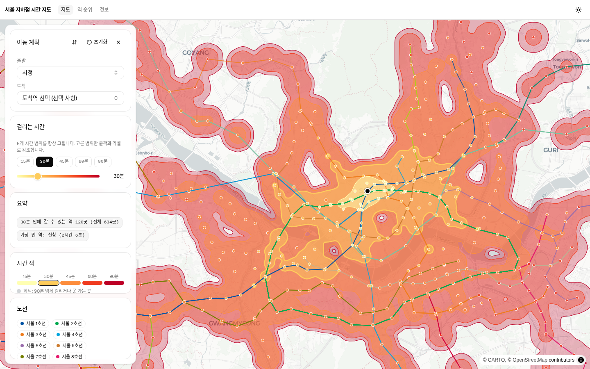
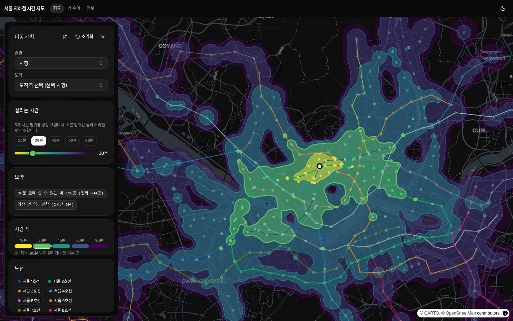
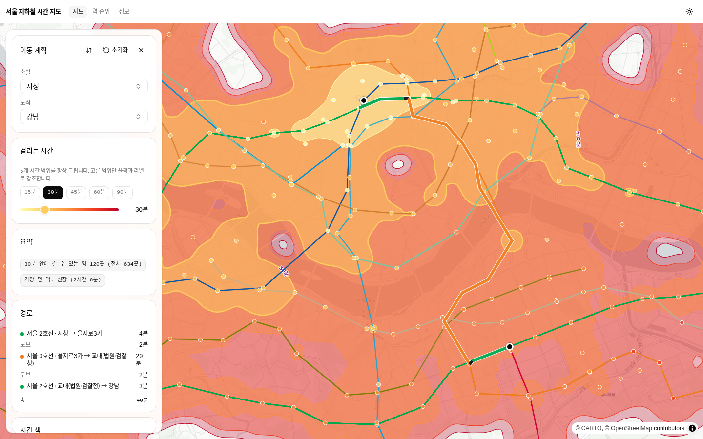
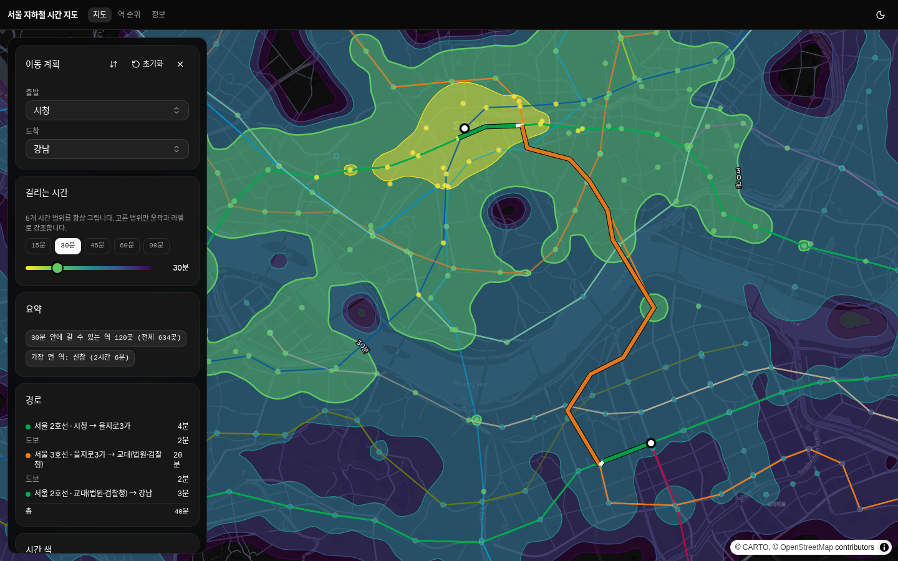
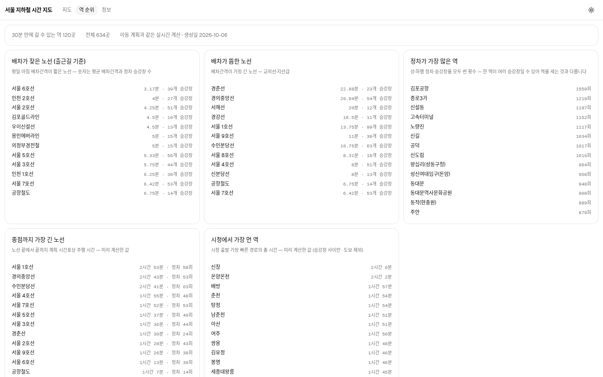
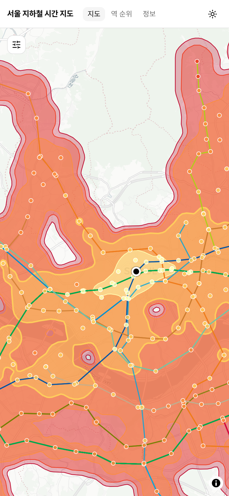

# 서울 지하철 시간 지도 · Seoul by Subway

서울 지하철 22개 노선으로 **몇 분 만에 어디까지 갈 수 있는지** 보여주는 등시선(isochrone) 지도.
출발지를 고르면 다섯 시간 범위(15/30/45/60/90분)가 링으로 모두 뜨고, 칩과 슬라이더로 이 중 하나를 강조한다. 역은 걸리는 시간 색으로, 이동 경로는 카드로 뜬다.
서버도 API 키도 없이, 정적 JSON 두 개와 브라우저 안의 다이익스트라로만 굴러간다.
A static isochrone map of the Seoul metro — pick an origin and see how far (and how fast) you can go.

[](https://coldtbrew.github.io/seoul-tram/)




*라이트 모드 · 다섯 시간 범위를 모두 켠 화면 (ColorBrewer YlOrRd — 옅은 노랑이 가깝고 진한 빨강이 먼 곳), 노선 공식색, 역도 같은 램프*

## 이 사이트는 뭘 보여주나

원작은 **« À portée de tram »**([tram.camilleroux.com](https://tram.camilleroux.com/), MIT © Camille Roux) — 집에서 몇 분 안에 어디까지 갈 수 있는지 보여주는 프랑스 트램용 시각화다. 그 **비용 모델**(도보 + 대기 + 승차를 더한 걸리는 시간, 역 색칠과 닫힌 등시선을 위한 시간 기반 색)을 서울 지하철 규모에 맞게 서울판으로 다시 만들었다.

서울 쪽으로 새로 만든 것은 이 세 가지다. ① **그래프의 노드는 역이 아니라 승강장**이다 — 같은 역의 상·하행 승강장이 50–200 m 떨어져 있고 호선별로 다른 stop_id를 쓰기 때문에, 승강장을 노드로 두면 개찰구를 나서서 다른 호선으로 갈아타는 시간이 자동으로 계산에 들어간다. ② **역간 이동 시간과 배차간격을 KTDB 국가교통DB GTFS에서 추정**한다 — 원작의 «Modèle»을 서울 데이터에 맞게 적용한 것이다. ③ 한글 역 이름·승강장 표기 검색, 노선색, 경로 카드, 라이트/다크 재조정이 필요했다.

> **English.** This is a Seoul re-implementation of [À portée de tram](https://tram.camilleroux.com/) by Camille Roux, sharing its cost model (walk + wait + ride, colours keyed to travel time, closed isochrone rings). **Platforms** — not stations — are the graph nodes, so leaving the paid area for a transfer and walking from your door to the platform both cost time, with no hand-tuned interchange penalties. Ride times and headways are derived from the KTDB national GTFS feed instead of a curated timetable, and isochrones are built as closed contours from a 150 m time grid. The app has three tabs: isochrones, station rankings, and about.

## 기능

- 시간 등시선 링 **15 / 30 / 45 / 60 / 90분** — 다섯 개를 항상 함께 켭니다 (칩과 슬라이더로 이 중 하나만 강조 가능). 150 m 격자에서 계산한 **닫힌 링**이라, 못 가는 곳은 어떤 링에도 채워지지 않는다
- **걸리는 시간으로 역 색칠** — 0분에 가까울수록 진한 색(90분 초과는 회색), 범례 카드는 등시선 색과 노선색 두 개
- **이동 계획 카드** — 도보 → 승차 → 환승 순서대로 각각의 시간과 노선색 점, 마지막에 총 걸리는 시간 (시청 → 강남은 지금 데이터에서 약 40분, 2호선·3호선을 타고 도보 구간 두 개를 지난다)
- **역 검색** — 한글 부분 일치(`을지로` → 을지로입구 · 을지로3가 · 을지로4가), 승강장 표기를 그대로 쳐도 매칭(`왕십리(성동구청)` → `왕십리`), `경도, 위도` 좌표 직접 입력
- **지도 클릭으로 도착 지정**(가까운 역이든 임의 지점이든), **출발 마커 드래그로 출발지 이동**, 출발/도착 교환 버튼, 지도를 드래그하면 등시선이 옅어진다
- **커서 위치의 걸리는 시간 표시** — 가까운 승강장 위에 마우스를 올리면 커서가 손가락으로 바뀌며 `역 이름 · 시간 (도보 포함)` 툴팁이 뜬다 (판정 반경은 지도를 축소하면 넓어지고 확대하면 좁아진다 — 최소 120 m)
- **URL 공유** — `?from=시청&to=강남`처럼 주소줄을 복사하면 열자마자 같은 뷰가 보이고, 앱 안에서 출발/도착을 바꾸면 주소줄이 따라 바뀐다
- **역 순위 탭** — 상단의 "N분 안에 갈 수 있는 역 N곳"은 지도와 같은 실시간 계산(출발지를 바꾸면 함께 바뀐다), 그 아래 배차간격·정차 횟수·가장 긴 완주·가장 먼 역 표는 Python에서 미리 계산 — 승강장 사이만 세는 별개의 계산이라 문 앞까지 도보를 포함하지 않는다
- **라이트 / 다크** 테마 — 처음엔 시스템 설정을 따르고, 헤더 오른쪽 해/달 버튼으로 바꾸면 localStorage에 저장한다. 두 테마에서 등시선 램프를 따로 맞췄다 (라이트 ColorBrewer YlOrRd · 다크 Viridis)
- 경로를 고르면 출발·도착이 화면 가장자리에 붙지 않도록 패널을 뺀 남은 영역의 18%를 여백으로 두고 맞춘다 (최대 줌 14). 시간 슬라이더는 마우스·터치로 끌 수 있고, 끄는 동안 지도나 시트는 따라 움직이지 않는다.
- **접이식 패널** — 지도는 항상 전체 폭이고 패널은 위에 뜬다 (데스크톱 왼쪽 · 모바일 아래). 지도를 움직이면 패널이 자동으로 접혀 지도가 전체를 차지하고, 열기 버튼으로 다시 편다
- 서버·데이터베이스·API 키 없음 — 정적 파일과 JSON 두 개만 서빙한다

## 화면

<table>
  <tr>
    <td width="50%"><br><sub>다크 모드 (CARTO Dark Matter) · 같은 화면 — 역과 링은 Viridis 램프</sub></td>
    <td><br><sub>시청 → 강남 경로 카드 (2호선→3호선→2호선, 총 40분) + 지도 경로 하이라이트</sub></td>
  </tr>
  <tr>
    <td><br><sub>같은 경로, 다크 모드</sub></td>
    <td><br><sub>역 순위 탭 (배차가 잦은/뜸한 노선, 정차가 가장 많은 역, 종점까지 가장 긴 노선, 시청에서 가장 먼 역)</sub></td>
  </tr>
</table>

<p align="center">
  <br>
  <sub>모바일 · 패널을 접은 상태 (등시선이 지도 전체)</sub>
</p>

## 시간을 계산하는 방법

링과 색은 전부 **문 앞 → 문 앞** 시간이다. 두 역 사이를 잇는 간선은 **한 열차가 두 승강장에 모두 정차하는지**에서 만들고, 승차 간선이 없는 승강장쌍은 450 m 이내일 경우 도보 간선이 된다.

| 항목 | 규칙 |
| --- | --- |
| 역간(승강장 간) 승차 시간 | KTDB 국가교통DB GTFS `stop_times.txt`에서, 한 승강장쌍에 정차한 **모든 열차의 계획상 걸리는 시간 중앙값** |
| 승차·환승 대기 | 승강장별 **배차간격 ÷ 2**, 1–15분으로 제한. 배차간격 = 평일 07–20시 연속 출발 간격의 중앙값(노선별 → 승강장 중앙값) |
| 도보 | 직선거리 ÷ **75 m/분**. 출발지가 역이 아닌 임의 지점이면 반경 1.2 km 이내 승강장을 도보로 잡는다 (반경 밖 = 못 가는 곳) |
| 환승 | 같은 역 안 승강장 간 이동 + 다음 열차 대기 — 별도 환승 벌점은 없다 (이 저장소의 v0 정적 버전은 고정 환승 벌점을 썼지만 v1에서 없앴다) |
| 등시선 | 150 m 격자 각 칸의 시간 = min(주변 승강장까지 걸리는 시간 + 칸까지 도보) → d3-contour로 등치선을 뽑아 **닫힌 링**으로 만든다 |

이동 시간은 `(승강장, 승차 중인 노선)` 쌍을 상태로 보는 다이익스트라로 계산한다. 대기는 노선을 **타는 순간**에만 붙고, 같은 노선 안의 이동에는 대기를 물리지 않는다. 경유 역 색·등시선·요약("N분 안에 갈 수 있는 역 N곳")은 전부 이 결과에서 파생한다.

**알고리즘 한계 — 이 숫자를 그대로 믿으면 안 되는 이유**

- 실시간이 아니다. 시간대·요일 구분 없는 상시 평균이라 퇴근길·주말·첫차 막차 시간이 틀린다.
- 급행·완행·직결을 한 승강장쌍에 평균으로 합친다 — 9호선 급행처럼 정차 패턴이 다른 트립이 완행 시간과 섞이며, 여러 노선이 지나는 승강장쌍은 그중 한 노선으로 처리한다.
- GTFS에서 추정한 배차간격이라 공식 시간표와 다를 수 있다. 이 피드의 트립은 "열차 1대"가 아니라 단순화된 계획 패턴이라(한 트립이 같은 정류장을 수십 번 지남) 07–20시 전체를 평탄한 배차로 본다 — 그래서 배차간격은 실제보다 짧게, 승차 시간은 완행/급행 평균으로 나온다.
- 도보 거리는 직선거리다 — 강·언덕·담장·개찰구를 무시하고, 1.2 km를 직선으로 떨어지면 지도 위에 원형 공백이 생긴다.
- 순위 탭의 표들은 이 계산과 **별개로** 시간표 평균을 Python에서 사전 계산한 값이다 (정차 횟수·배차간격·최장 완주 — 승강장 사이만 센다). 그래서 이 표들의 숫자는 지도와 같은 조건으로 계산한 값이 아니다.

## 기술 스택 · 코드 구조

Vite 8 · React 19 · TypeScript 6 · Tailwind CSS 4 · shadcn/ui(Base UI) · **MapLibre GL JS 6** · CARTO Positron / Dark Matter(키 불필요) · Geist Variable · d3-contour.

```
src/lib/        순수 계산 코어 — DOM·React·MapLibre를 모른다
  graph.ts      (승강장, 승차 노선) 상태 Dijkstra · nearestStops(도보 반경 검색) · timeToPoint · routeTo
  iso.ts        150 m 걸리는 시간 격자 → d3-contour 닫힌 링 (120 - t 트릭으로 못 가는 셀 처리)
  search.ts     역 이름 / "경도, 위도" 좌표 → Place 해석 (URL과 검색창이 같은 규칙)
  format.ts constants.ts types.ts utils.ts   포맷·색 램프, 튜닝 상수, 공용 타입
src/map/        MapLibre와 만나는 유일한 경계
  MapCanvas.tsx 마커·클릭/호버 처리, 테마 전환 시 스타일 재로딩
  layers.ts     커스텀 레이어 정의(iso-fill, iso-line, lines, stations, route-casing, route)
  basemap.ts    CARTO style URL (라이트 Positron · 다크 Dark Matter)
src/hooks/      useTripPlan(파생 계산) · useNetworkData(fetch) · useTheme(테마)
src/components/ StationSearch · TripPanel · RankingsView · AboutView · LegendCard · ThemeToggle · ui/(shadcn)
scripts/        build_data.py(Python 데이터 빌드) · probe-rings.ts · verify-screenshots.mjs
public/data/    network.json · rankings.json   ← 빌드 산출물, 정적으로 서빙
data/raw/       원본 GTFS zip (gitignore)
```

데이터는 한 방향으로만 돈다 — `출발지 / bounds / 테마 → useTripPlan(파생 계산) → 렌더와 재페인트`. MapLibre의 명령형 API는 `src/map/` 안에서만 쓰고, 테마 전환처럼 스타일 전체를 갈아끼우는 지점도 이 경계 안에 묶어 뒀다. **`src/map/`을 고칠 계획이라면** [docs/architecture.md](docs/architecture.md)의 후보 A/B 비교와 NOTES.md의 데이터 탐색 메모를 먼저 읽을 것 (등시선 정의와 테마 전환 레이스가 여기서 두 번 깨졌다).

## 로컬 개발

```bash
npm ci
npm run dev      # http://localhost:5173/seoul-tram/
npm run build    # dist/ 에 정적 사이트 생성
npm run preview  # http://localhost:4173/seoul-tram/
```

- `npm run build`는 `tsc -b` 뒤에 Vite(rolldown 빌더)를 돌린다. CI와 같은 것을 쓰려면 **Node 22**를 맞추면 된다 (GitHub Actions도 Node 22에서 같은 명령을 돌린다).
- MapLibre v6는 워커를 별도 모듈로 뽑는다. `vite.config.ts`의 `optimizeDeps.exclude: ["maplibre-gl"]`와 `MapCanvas.tsx`의 `setWorkerUrl(workerUrl)`이 짝으로 살아 있어야 타일 워커가 404 나지 않는다 — 둘 중 하나가 사라지면 **지도가 아무것도 없는 채로 렌더링된다.**
- `src/lib/`은 React·DOM을 모르는 순수 함수다 (지도 없이 단독 호출 가능). 격자/링의 좌표 대응은 `scripts/probe-rings.ts`로 확인한다.

## 데이터 파이프라인

`scripts/build_data.py`가 원본 GTFS를 읽어 `public/data/network.json`(그래프)과 `rankings.json`(순위 탭)을 만든다. 압축을 `data/raw/GTFS_Korea.zip`으로 받아두면 된다 — 압축 해제 시 3 GB(shapes.txt 1.58 GB, stop_times.txt 1.52 GB)라 스크립트가 zip member를 스트리밍으로 읽어 필요한 행만 고른다.

```bash
# https://huggingface.co/datasets/Digital-Twin-Urban-Mobility/GTFS-Korea
#    → 압축을 풀지 말고 GTFS_Korea.zip 그대로 data/raw/ 에 받는다 (내부 경로: GTFS_Korea/*.txt)
python3 scripts/build_data.py     # → public/data/*.json + 검증 출력
```

```bash
# 같은 파일에서 필요한 행만 고르는 탐색용 예시 (full extract 필요 없음)
unzip -j GTFS_Korea.zip GTFS_Korea/stops.txt -d /tmp/gtfs
unzip -p GTFS_Korea.zip GTFS_Korea/stop_times.txt | grep -F -f /tmp/gtfs/keep_stop_ids.txt > /tmp/gtfs/stop_times.txt
```

들어가 있는 것은 **22개 노선 / 734개 승강장(= 634개 역 클러스터) / 936개 간선(승차 + 도보)**이다. `route_type=1`만 고르고 그중 `GTX_`는 뺐다 — 부분 개통·계획 구간이라 이 GTFS의 기하와 시각이 실제와 다를 수 있기 때문이다. 같은 이름의 승강장이 여러 개면(1·2호선 시청, 서울역은 5개) **350 m 이내를 하나의 역 클러스터로** 묶어 라벨과 순위 통계를 공유하게 한다 — 이름이 같아도 10 km 이상 떨어진 경우(수원시청/하남시청/시청·용인대)가 있어서 이름만으론 묶이지 않는다.

## 배포

`main`에 푸시하면 GitHub Actions([`.github/workflows/deploy.yml`](.github/workflows/deploy.yml))가 `npm ci && npm run build`를 돌리고 `dist/`를 GitHub Pages 아티팩트로 올린다. 사이트가 `/seoul-tram/` 하위경로에 살기 때문에 `vite.config.ts`의 `base: "/seoul-tram/"`이 필요하고, 두 JSON은 `import.meta.env.BASE_URL` 상대경로로 fetch한다. 시크릿·API 키는 없다.

## 크레딧

- **« À portée de tram »** — [tram.camilleroux.com](https://tram.camilleroux.com/), MIT © Camille Roux. 아이디어와 비용 모델(도보 + 대기 + 승차, 시간 기반 색, 닫힌 등시선)의 출처.
- **KTDB 국가교통DB** 전국 GTFS — [Hugging Face GTFS-Korea 미러](https://huggingface.co/datasets/Digital-Twin-Urban-Mobility/GTFS-Korea)에서 받았다.
- **지도 타일** © OpenStreetMap contributors (ODbL) · **베이스맵 스타일** © CARTO (Positron · Dark Matter).
- **Geist Variable** 서체 (Vercel).

## 개발 비용 / 토큰 통계 · Development cost

**Grok Bot(스파키)는 조언·검증·배포를 맡았고, 코드 작성은 로컬 모델이 담당했습니다.**
Grok Bot (Sparky) advised pi, verified the UI with Playwright screenshots, and handled the GitHub Pages deploy — it did not write the application code. Coding tokens are only the local-model numbers below.

### 로컬 코딩 모델 · Local coding model
| 항목 | 값 |
| --- | --- |
| 모델 | Qwen3.8-Flash-Next (TensorFold on DGX Spark), thinking = medium |
| 에이전트 | pi coding agent (herdr session `seoul-tram`) |
| 측정 구간 (KST) | 2026-10-06 20:49 – 2026-10-07 09:04 |
| 요청 수 | 697 |
| 생성 토큰 (completion) | 1,145,448 |
| 프롬프트 토큰 | 87,634,993 (대부분 prefix-cache hit) |
| decode tok/s (요청당) | median 57.2 / mean 58.8 / p90 72.3 / max 95.6 / min 40.5 (08:17까지 집계) |
| token-weighted decode | 55.0 tok/s |
| MTP acceptance | 72.8% |

Round 2만 (등시선·패널·문구·슬라이더, 2026-10-07 07:01–08:17): 요청 186, 생성 169,439 토큰, median 59.2 tok/s, MTP 75.2%.

Round 2 수정 배치 (슬라이더 드래그·테마 버튼·경로 여백·모바일 padding, 2026-10-07 08:37–09:04): 요청 29, 생성 25,766 토큰, 프롬프트 6,667,036 토큰, token-weighted decode 58.3 tok/s, MTP 79.3%.

### 감독 · Supervisor (Grok Bot / 스파키)
Grok Bot 쪽 **정확한 토큰 수는 미수집**입니다. 코딩 토큰은 위 표가 전부입니다.
| 항목 | 값 |
| --- | --- |
| 역할 | 지시 메모 · Playwright 시각 검증 · 스크린샷 · GitHub Pages 배포 |
| 감독 라운드 | 약 11회 중간/최종 보고 |
| 프로젝트 wall-clock (KST) | 2026-10-06 저녁 – 2026-10-07 오전 (약 12시간, 중단·재개 포함) |

### 프로젝트 규모 · Project stats
| 항목 | 값 |
| --- | --- |
| 라이브 | https://coldtbrew.github.io/seoul-tram/ |
| 기본 브랜치 / 커밋 | `main` · 30+ commits (HEAD는 이 커밋) |
| 영감 | [À portée de tram](https://tram.camilleroux.com/) (Camille Roux, MIT) |

## 라이선스

코드는 [MIT](LICENSE) — 원작 « À portée de tram »의 MIT 조항을 함께 지킨다. **데이터는 라이선스가 따로 있다**: KTDB 국가교통DB 원본과 OSM/CARTO 타일·스타일은 각 출처의 조건을 따른다.
